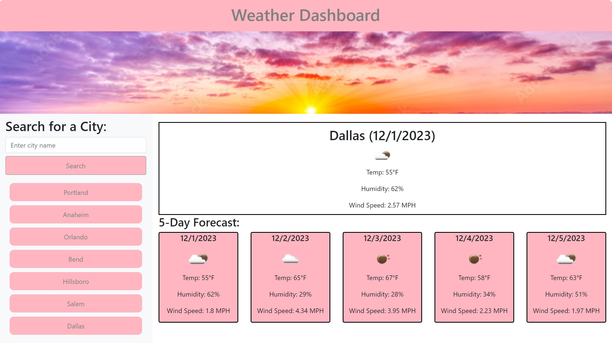

# Weather-Dashboard (Module 6 Challenge)

## Description

This Module 6 Challenge was given to me to complete. The goal was to build a weather dashboard that can display the current weather in the city that you search for along with a 5-day forecast for that city.

## Installation

N/A

## Usage

To use this webpage, the user can type any city into the search bar. Upon clicking "Search", the current weather for the city the user selected will appear on the page along with a 5 day forecast for that city. All of users previously searched cities will appear on the page for easy reference. Instead of re-searching for the same city, the user can simply click on the city name and the current weather will appear again.

## Credits

Code was created and commented by myself. I referced the content we learned in class for this assignment.

## Link

https://shhutc18.github.io/Weather-Dashboard/

## Screenshot

## License

Please refer to the LICENSE in the repository.